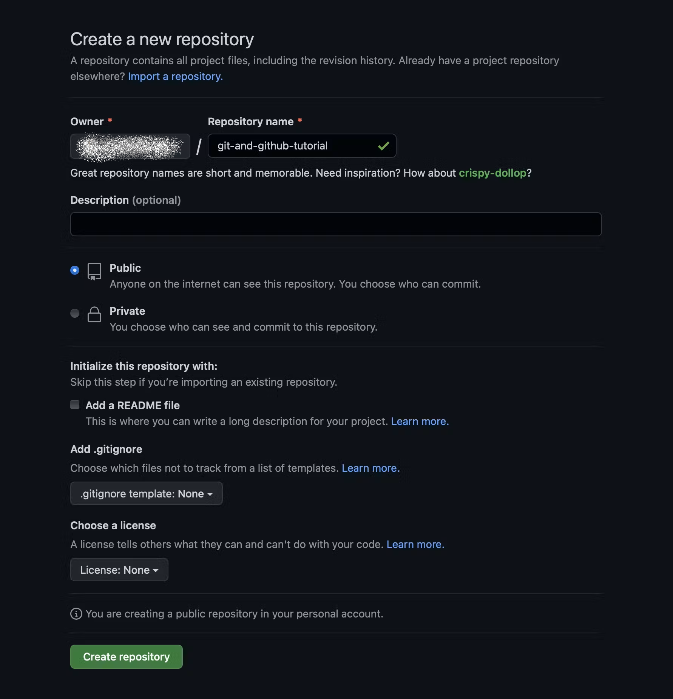
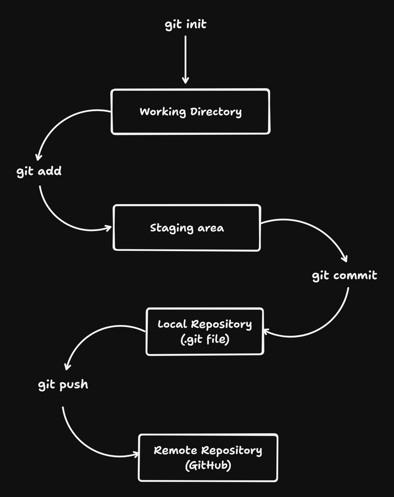

Let's begin with the fundamentals. Git is a distributed version control system designed to track changes in a project’s files. Git was released in 2005 by Linus Torvalds. It is used to integrate modifications from many branches and manage your code's history. I recognize that you are currently unfamiliar with concepts like branches, merges, and version control. Don't worry, though; this tutorial will teach us about them.

**Important note : Git and GitHub are not the same thing this will be discussed further.**

# What is a Repository ?

Consider it as a place where all your project’s file will be stored it is of two types -

1. local repository
    
2. remote repository
    

Later on in this blog, we will cover this topic in more detail.

# What is Git

**Git** is a version control system that allows you to **monitor file changes**. It is a **free and open-source** program that works with Linux, macOS, and Windows. Keep in mind that GIT is software that you can install on your computer.

# **Get started with Git**

The Git software is a powerful command-line tool that you can install on your machine, whether you use Windows, macOS, or Linux.  
**Installing Git**  
On Windows using command prompt  
`winget install --id Git.Git -e --source winget`  
On Mac  
`$ git --version`  
This will open a prompt if you don’t have git already. Thus, use the installer to set it up. It will simply display the version of git that is installed if you already have it.  
On Linux  
`$ sudo apt install git-all`  
if you are having any trouble installing it, go to this [**official website**](https://git-scm.com/downloads) for more info on how to get it done.

# **Local repository**

Local repository is nothing but your current working directory, it is a Git repository that's hosted on a user's computer.

A local repo is made using following git command

`git status`  
`git init`

`git status` command will show you the current state of your repository. `git init` command will create a new folder on your system and initialize it as a git repository. This adds a hidden `.git` folder to your project.

# What is GitHub

**GitHub** is an online platform that **hosts Git repositories**. You can store and **share your code** with others via the web platform GitHub. It is a well-liked platform for developers to share code and work together on projects. Although GitHub is one of the most well-known providers of Git repositories, it is not the only one.

# **Get Started with GitHub**

To create your account, you need to go to [GitHub's website](https://github.com/) and fill out the registration form.


# **Remote repository**

A Remote Repo is made on GitHub using following steps

Step 1: Go to [this link](https://github.com/new) Click on new


Step 2: Click on create repository

Give your repository a name, and description(optional), choose if you want to make it a public or a private repo(only you and the people you give access can see a private repo), and you can also add a readme and a license if you want. Otherwise, leave all that options as it is and click create repository.



Now your Remote repository will be created.

# Connect Local repository to Remote Repository

Type the following commands into your command line to connect the two repositories; you can also find these commands in your new repository's quick setup section.

```powershell
git init
git add README.md
git commit -m "first commit"
git branch -M main
git remote add origin git@github.com:JafriAli1/chai-cohort.git
git push -u origin main
```

for further details on these topics please visit [this website](https://docs.chaicode.com/git-and-github/)

# Workflow



# Writing Commit Messages

Commit message writing is essential to a codebase's health and maintainability. Consider them your project's live history. The breakdown is as follows:

## 1\. Keep it Brief and Detailed:

Brief and Sweet: Try to keep messages to no more than 50 characters.  
Descriptive: Clearly explain the goals of the commit.  
For instance, "Fix: Incorrect calculation in calculate\_tax()" is preferable to "Fix bug"  
Use the Present Tense: "Add feature" did not "Added feature"

## 2\. Adhere to conventions:

Consistent Formatting: Use a consistent style (e.g., imperative mood, all lowercase, etc.).  
A template such as "Type: Scope: Short description" (e.g., "Fix: API: Handle invalid input") is used by many teams.  
Conventional Commits: Consider utilizing a conventional structure for simpler automation (e.g., "feat", "fix", "docs", "refactor").

## 3\. Pay Attention to the "Why":

Give a brief explanation of the reasoning behind the modification.  
For instance: "Fix: API: Handle invalid input to prevent server errors"

## 4\. Steer clear of these pitfalls:

Vague Messages: "Code cleanup" and "Minor fixes" are worthless!  
Big Promises: Divide big changes into smaller, more targeted commitments.  
Making Unrelated Modifications: Keep a single issue at the center of each commit.

## 5\. Resources & Advice:

Use a nice commit message hook: Enforce fundamental guidelines and offer beneficial advice.  
Examine your own commitments: Before pushing, take a moment to review your message.

for more details on this please visit [here](https://www.conventionalcommits.org/)